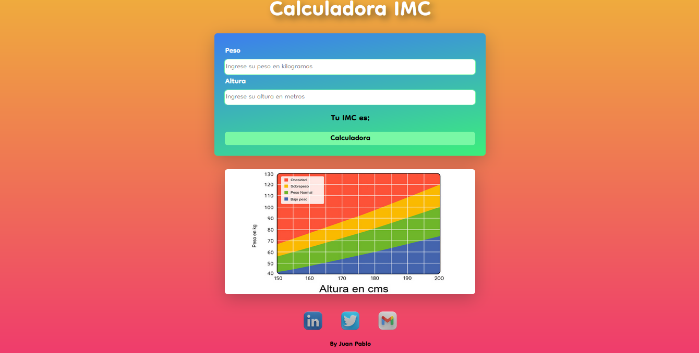

# Calculadora de índice de masas corporal o IMC

## Descripción

Esta calculadora te indica tu **IMC** y contiene una imagen de referencia para que puedas compararlo con los estándares esperados basándose en la imagen.

> Esta es una práctica basada en el código de [Lucas Moy](https://youtu.be/mnNgNI6QhfE)

## Demo

[live](https://boudgnosis.github.io/calculadora-IMC/) 

